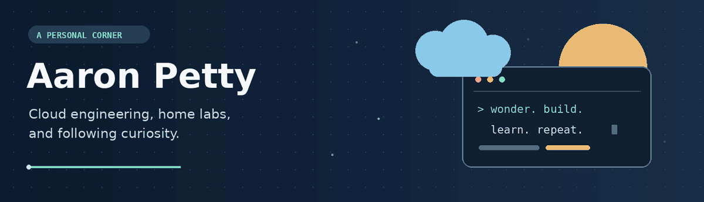

  

Some projects begin with a plan. Others begin with “wonder if this would work” and a Raspberry Pi.

Technology has been a long-running interest, growing from troubleshooting systems into exploring Azure, automation, and now AI. The satisfying part is figuring out how the pieces fit together—and turning that understanding into something useful.

## 🧪 Room to experiment

This GitHub is a place for that curiosity: exploring ideas, working through problems, and giving projects somewhere to grow.

Azure, Bicep, and GitHub Actions are familiar tools. At home, the questions look a little different: getting Docker services running on a Raspberry Pi, sorting out DNS, or convincing a reverse proxy to cooperate.

There’s always another detail to understand, another approach to try, or something worth documenting for next time.

## ♟️ Beyond the keyboard

Home is in the Dallas–Fort Worth area, with a family of five and plenty happening away from a screen.

Other interests include BBQ, live music, travel, and a game of chess with my son. Those leave room for a different kind of tinkering—and a good reason to step away from a stubborn technical problem for a while.

## 💡 Following the next question

Lately, AI and automation have been opening up new possibilities to explore. The most interesting ideas tend to start small: a repetitive task, an awkward process, or a question about whether something could be easier.

Some become useful tools. Others teach a lesson and make the next attempt better.

Both are worth the time.

---

**Often working with:** Azure · Bicep · GitHub Actions · Docker · Raspberry Pi

  

**Currently exploring:** AI, automation, and better ways to connect the pieces

  <a href="https://azure-admin-aaron.github.io/Azure-admin-aaron/index.html"><strong>Portfolio ↗</strong></a>
  &nbsp; · &nbsp;
  <a href="https://www.linkedin.com/in/aaron-petty-a0a09860"><strong>LinkedIn ↗</strong></a>

